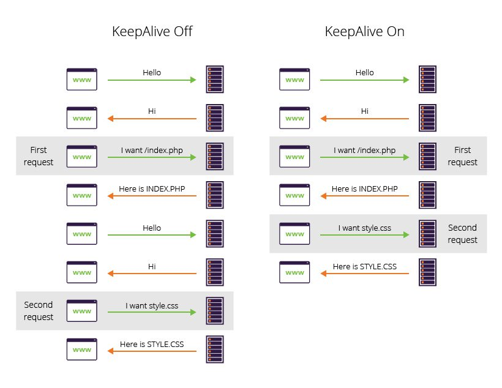

# HTTP Keep-Alive reuses TCP connections across multiple requests

HTTP/1.1 introduced **"Keep-Alive"** (also called "persistent connections"), which allows the TCP connection to remain open and be reused for **multiple request-response cycles**.

Without Keep-Alive, the connection closes after each response, requiring a new three-way handshake for every request.

With Keep-Alive:
1. Client establishes TCP connection (three-way handshake)
2. Sends HTTP request → gets response
3. **Connection stays open**
4. Sends another HTTP request → gets response (same TCP connection, no new handshake!)
5. Sends another request → gets response (still same connection)
6. Eventually the connection closes due to timeout or explicit closure

This is an **efficiency improvement** because establishing TCP connections is expensive (three-way handshake overhead).

However, **Keep-Alive is still request-response only**. The server still cannot send data unless the client requests it first. Each message pair still has HTTP header overhead.

WebSocket goes further by upgrading the connection to enable true bidirectional communication.

## Links

- [[HTTP request-response model prevents server-initiated data push]]
- [[Connection pooling reuses connections at application level to reduce overhead]]
- [[WebSocket upgrades HTTP connection to enable bidirectional communication]]
- [[Networking MOC]]
