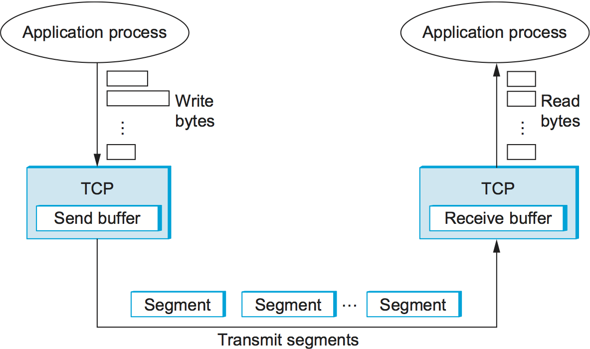

# TCP stream abstraction hides packetization from applications

The word "stream" has two different meanings depending on context.

**TCP Stream (Protocol Level):** TCP is called a **"stream-oriented protocol"** because it provides a **continuous, ordered flow of bytes** to applications. From the application's perspective, data appears as one unbroken stream.

You write 1000 bytes, and the receiver reads 1000 bytes in order, as if they flowed continuously without gaps.

**Streaming (Application Level):** "Streaming" often refers to sending data in **small chunks over time**—like video streaming where video data is sent piece by piece as you watch.

Here's the paradox: **At the network level, data is broken into packets** that travel independently and possibly arrive out of order. But **TCP hides this complexity** from your application.

What you see (application level): continuous stream of bytes flowing.
What actually happens (network level): data broken into packets, each traveling separately, possibly out of order, then reassembled.

TCP uses **sequence numbers, acknowledgments, and reordering** to make the packetized reality look like a continuous stream.

## Links

- [[TCP packets carry data chunks with headers and payload]]
- [[UDP preserves message boundaries unlike TCP streams]]
- [[TCP MOC]]
