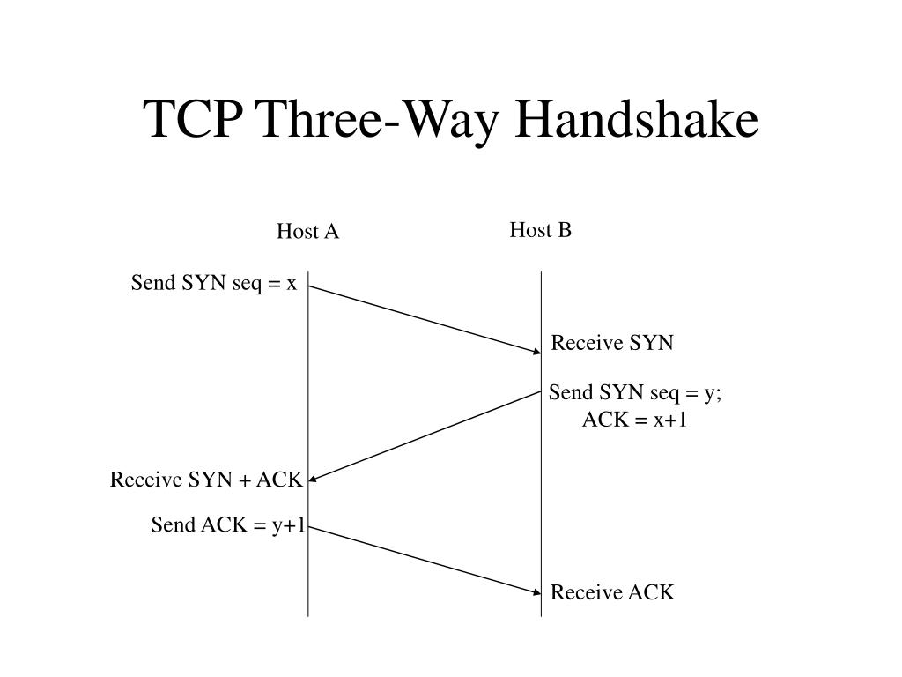

# TCP three-way handshake establishes connection with SYN-SYN-ACK-ACK

The TCP three-way handshake is the process by which two hosts establish a connection **before exchanging data**.

##### **Step 1 (SYN):** 

Host A sends a SYN packet to Host B saying 
> "I want to connect, 
> and my Initial Sequence Number is X."

##### **Step 2 (SYN-ACK):** 

Host B responds with a SYN-ACK packet saying 
> "I received your SYN with sequence X, 
>  I'm ready for X+1 next, 
>  and my Initial Sequence Number is Y."

##### **Step 3 (ACK):** 

Host A sends an ACK packet saying 
> "I received your sequence Y, 
>  I'm ready for Y+1 next."

After these three exchanges, the connection is established and data transmission can begin.

The handshake synchronizes sequence numbers between both hosts, enabling reliable tracking of data throughout the connection.

## Links

- [[SYN synchronizes Initial Sequence Numbers between hosts]]
- [[ACK acknowledges receipt and specifies next expected sequence number]]
- [[TCP provides reliable ordered error-checked data delivery over networks]]
- [[TCP MOC]]
